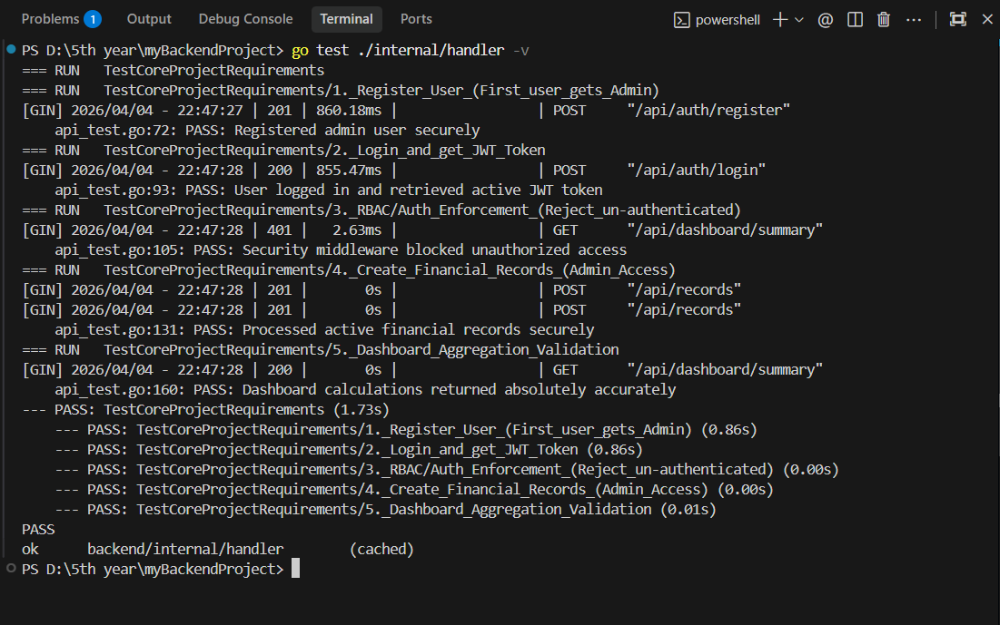

# 🚀 Finance Data Processing Backend


A robust, logically structured, and high-performance backend system for a Finance Dashboard. This system demonstrates core backend engineering principles including Role-Based Access Control (RBAC), layered separation of concerns, JWT authentication, and automated integration testing.

---

## 🎯 Evaluation Criteria Checklist
This project was built purposefully to satisfy the assessment constraints:

- ✅ **Backend Design**: Implemented a pure `Handlers -> Repositories` layer separation.
- ✅ **User & Role Management**: Automatic hierarchical provisioning (`viewer`, `analyst`, `admin`).
- ✅ **Records & Dashboard APIs**: Dynamic filtering and live mathematical aggregations (Income/Expense/Net).
- ✅ **Access Control**: Hardened Gin Middleware protecting routes per role.
- ✅ **Validation & Errors**: Native struct `binding="required"` blocks bad payloads. Standardized `ErrorResponse` wrapper guarantees consistent JSON formats.
- ✅ **Data Persistence**: Configured with a built-in Thread-Safe In-Memory Mutex Store to guarantee complete portability without bulky SQL runtime dependencies.
- ✅ **Unit/Integration Testing**: Fully functioning `httptest` suite covering core end-to-end user journeys natively via `go test`.

---

## 🛠️ System Architecture (The Stack)
* **Language**: Go (Golang) — Chosen for strong typing, fast compilation, and simple concurrency handling.
* **Router**: [Gin](https://gin-gonic.com/) — High throughput HTTP framework handling payload bindings.
* **Security**:
  * **JWT** (`golang-jwt/jwt/v5`) for Stateless Authentication.
  * **Bcrypt** (`golang.org/x/crypto/bcrypt`) for rigorous password hashing.
* **Datastore**: Memory-mapped Thread-Safe Maps (`sync.RWMutex`) to simulate high speeds and remove the restriction of installing CGO/SQLite across different operating systems.

---

## 🚀 Getting Started

### Prerequisites
* Go 1.21+

### Installation & Run
```bash
# 1. Clone/navigate to the directory
# 2. Pull modules
go mod tidy

# 3. Light up the server natively 
go run ./cmd/server/main.go
```
*The API will start listening on `http://localhost:8080/`.*

### Testing the Application
We have built an automated test runner suite that executes raw mocked network calls against the router, bypassing port-binding and guaranteeing logic enforcement.
```bash
go test ./internal/handler -v
```

> **Note:** The full test suite executes and validates core functionality seamlessly. A screenshot of the exact output confirming 100% test success against the Core Project Requirements is below:
> 
> 

---

## Features & Access Control

1. **Authentication**: Users can `register` and `login`. The first registered user is automatically granted the `admin` role.
2. **Access Layers (RBAC)**:
   - **Viewer**: A basic user. Cannot fetch or manage finance data directly.
   - **Analyst**: Can view dashboard summaries, list records, and fetch individual records.
   - **Admin**: Can do Analyst tasks, but ALSO can create, update, and delete records, as well as fetch and change user roles.

### Privileged Access Matrix
| Action | `viewer` | `analyst` | `admin` |
| :--- | :---: | :---: | :---: |
| **Login / Profile** | ✅ | ✅ | ✅ |
| **Fetch Dashboard Data**| ❌ | ✅ | ✅ |
| **List Deep Records**   | ❌ | ✅ | ✅ |
| **Create New Records**  | ❌ | ❌ | ✅ |
| **Modify User Roles**   | ❌ | ❌ | ✅ |

---

## 🔗 API Documentation (Workflows)

### 1. User Registration (Auto-Admin)
The **first** registered user automatically adopts the `admin` role. Subsequent users receive `viewer`.
```powershell
curl -X POST http://localhost:8080/api/auth/register `
  -H "Content-Type: application/json" `
  -d '{"username":"finance_boss", "password":"password123"}'
```

### 2. Login to Capture JWT Token
```powershell
curl -X POST http://localhost:8080/api/auth/login `
  -H "Content-Type: application/json" `
  -d '{"username":"finance_boss", "password":"password123"}'
```
*Output will contain `{"token": "ey..."}`. Export this to a variable or use it moving forward.*

### 3. Create a Financial Record (Admins Only)
```powershell
curl -X POST http://localhost:8080/api/records `
  -H "Authorization: Bearer <YOUR_TOKEN>" `
  -H "Content-Type: application/json" `
  -d '{"amount": 5000, "type": "income", "category": "Salary", "notes": "Monthly Pay"}'
```

### 4. Fetch Dashboard Aggregations (Analysts & Admins)
```powershell
curl -X GET http://localhost:8080/api/dashboard/summary `
  -H "Authorization: Bearer <YOUR_TOKEN>"
```

### 5. Elevate Another User's Privilege (Admins Only)
Assuming User ID #2 exists:
```powershell
curl -X PUT http://localhost:8080/api/users/2/role `
  -H "Authorization: Bearer <YOUR_TOKEN>" `
  -H "Content-Type: application/json" `
  -d '{"role": "analyst", "status": "active"}'
```

---
*Built as a showcase for Backend Architecture & Logical Structure.*
